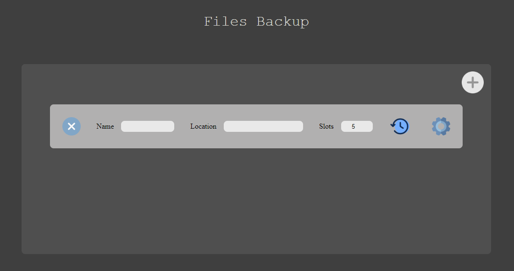
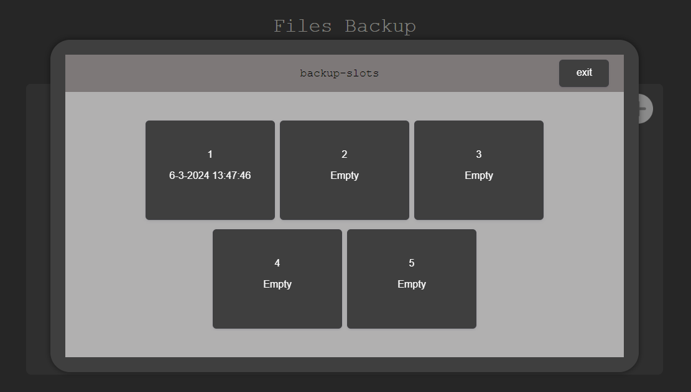

# Files Backup
## Made with Electron and Vite


<br><br><br><br><br><br><br>
  
# Summary

With this application is it possible to create backups for specific  ```files``` or  ```directories```.
It's possible to store up to a ```100``` slots

This application doesn't provide a restore option, so you have to do it ```manually```.
The reason for that's because restore will give certain risk and unpredictability. (risk of permanent removing necessary files)

# Images
<div style="display: flex; gap: 40px; flex-direction: column; align-items: center;">
    
    
</div>